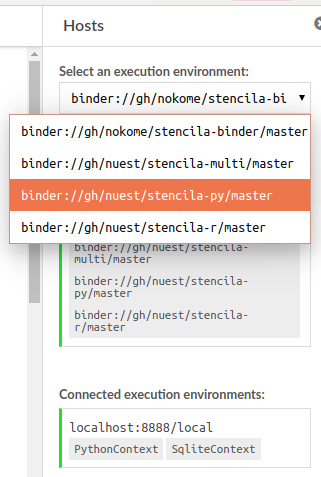

<p align="center">
  
</p>

# Bindilla: a Stencila to Binder bridge

[](https://travis-ci.org/stencila/bindilla)
[](https://codecov.io/gh/stencila/bindilla)
[](https://gitter.im/stencila/stencila)

## What?

Bindilla acts as a bridge between [Stencila](https://stenci.la) and [Binder](https://mybinder.org/). Using this bridge, clients such as Stencila Desktop or RDS Reader can request, and interact with, alternative execution envionments provided by Binder.

This bridge relies on [`nbstencilaproxy`](https://github.com/minrk/nbstencilaproxy) being in the container image that is launched by Binder. [`repo2docker`](https://github.com/jupyter/repo2docker) will detect Dar folders in a repo and install `nbstencilaproxy` and other necessary requirements automatically.



## Why?

Stencila clients talk to execution contexts using an [API](https://stencila.github.io/schema/host.html). This API is implemented by several packages including [stencila/py](https://github.com/stencila/py), [stencila/r](https://github.com/stencila/r), and [stencila/node](https://github.com/stencila/node). These packages are available within a Binder container via [nbstencilaproxy](https://github.com/minrk/nbstencilaproxy). You can embed a reproducible document into the container and launch it via a per-user Binder container.

However, in some cases you don't want to rely on having a running container to deliver your reproducible document to each reader. Instead, you can use a [progressive enhancement approach to reproducibility](https://elifesciences.org/labs/e5737fd5/designing-progressive-enhancement-into-the-academic-manuscript) in which reproducible elements can be made dynamic, on demand, based on user interaction. The API is designed to allow for this use case, allowing user interfaces to connect to alternative execution contexts both local and remote. By exposing the API as a bridge Bindilla enables this use case for execution contexts hosted on Binder.

## FAQ

### Why is this implemented in Python instead of Node.js, Go, or ...?

BinderHub, and much of the wider Jupyter ecosystem, is implemented in Python. We want to have an implementation that is familiar to that community.

### Why use Tornado as a server framework instead of Werkzeug, Flask, or ...

For the same reason we are using Python, because BinderHub uses Tornado.

### Why separate `host` and `host_http_server` files?

The `Host` is implemented in [`bindilla/host.py`](bindilla/host.py) and a HTTP server is implemented in [`bindilla/host_http_server.py`](bindilla/host_http_server.py). This is to maintain consistency with the code and file structure in other implementations of the Stencila Host API e.g. [`stencila/py`](https://github.com/stencila/py), [`stencila/node`](https://github.com/stencila/node). Although for Bindilla it probably only makes sense to have a HTTP server, in these other implementations there may be more than one server protocol providing access to the host and this structure provides for separation of concerns.

### Are there any funny, circa 1969, short films about Godzilla?

As it happens, [yes](https://www.youtube.com/watch?v=8s3UogfAGg0)!

## API

<!-- Autogenerated docs, do not edit below here! -->                                  

<h3 id="bindilla.host.Host">Host</h3>

```python
Host(self, binder_host='https://mybinder.org', proxy=True)
```

A Stencila `Host` that launches, and then proxies to, a container on Binder.

<h4 id="bindilla.host.Host.manifest">manifest</h4>

```python
Host.manifest(self, extra_environs=None)
```

Return the manifest for this host.

<h4 id="bindilla.host.Host.parse_environ">parse_environ</h4>

```python
Host.parse_environ(environ_id)
```

Parse an environ id into an environment spec to include in manifest.

Also split out the parts needed for a Binder repo path, which have the pattern
  `<provider-name>/<org-name>/<repo-name>/<branch|commit|tag>`
The `<branch|commit|tag> part is optional and defaults to `master`.

<h4 id="bindilla.host.Host.launch_environ">launch_environ</h4>

```python
Host.launch_environ(self, environ_id)
```

Launch an environment on Binder.

This sends a request to Binder to create a new container based on the
environment identifier.

<h4 id="bindilla.host.Host.proxy_environ">proxy_environ</h4>

```python
Host.proxy_environ(self, method, binder_id, token, path, body=None)
```

Proxy requests through to the binder.

This methods appends `/stencila-host` to the Binder container's URL
e.g https://hub.mybinder.org/user/org-repo-mukdlnm5/stencila-host
and puts the token into the header for authorization.

<h3 id="bindilla.host_http_server">bindilla.host_http_server</h3>


<h4 id="bindilla.host_http_server.BaseHandler">BaseHandler</h4>

```python
BaseHandler(self, application, request, **kwargs)
```

A base class for all request handlers.

Adds necessary headers and handles `OPTIONS` requests
needed for CORS. Handles errors.

<h4 id="bindilla.host_http_server.IndexHandler">IndexHandler</h4>

```python
IndexHandler(self, application, request, **kwargs)
```

Handles requests to the index/home page.

<h4 id="bindilla.host_http_server.ManifestHandler">ManifestHandler</h4>

```python
ManifestHandler(self, application, request, **kwargs)
```

Handles requests for Bindilla's `Host` manifest.

<h4 id="bindilla.host_http_server.EnvironHandler">EnvironHandler</h4>

```python
EnvironHandler(self, application, request, **kwargs)
```

Handles requests to launch an environment on Binder.

<h4 id="bindilla.host_http_server.ProxyHandler">ProxyHandler</h4>

```python
ProxyHandler(self, application, request, **kwargs)
```

Proxies requests through to the container running on Binder.

<h4 id="bindilla.host_http_server.make">make</h4>

```python
make()
```

Make the Tornado `RuleRouter`.

<h4 id="bindilla.host_http_server.run">run</h4>

```python
run()
```

Run the HTTP server.
